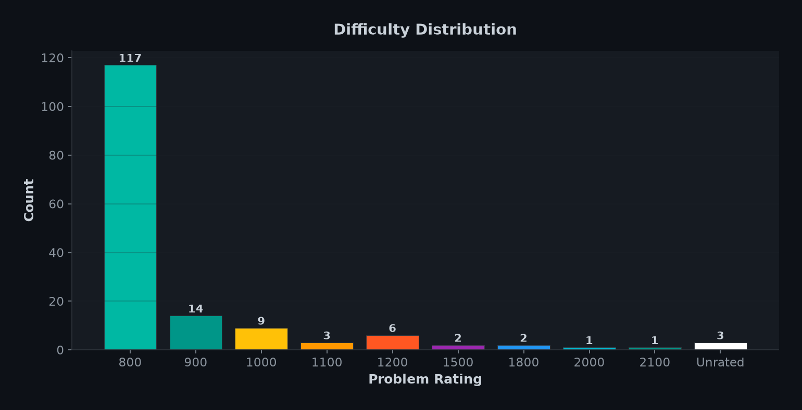
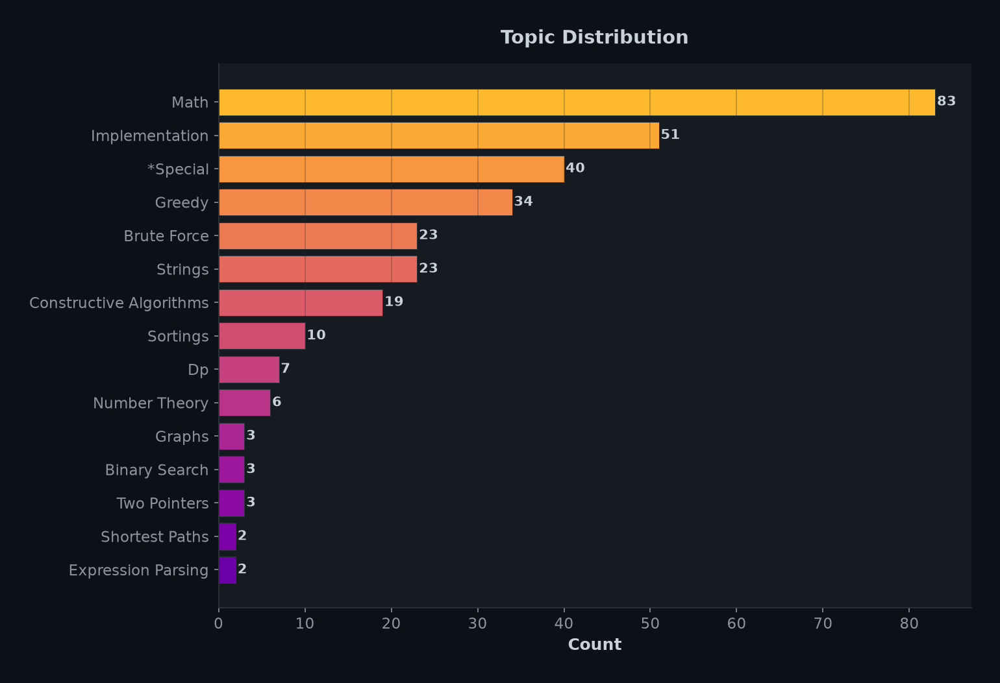
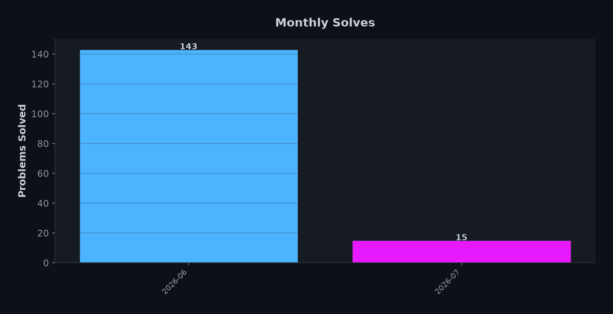
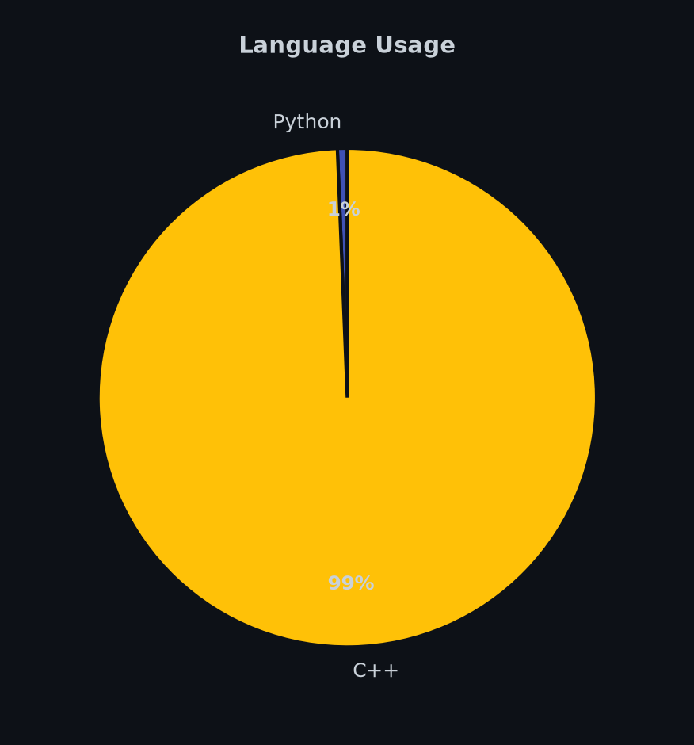

<!-- AUTO-GENERATED by script.py — do not edit manually -->

<div align="center">

# ⚔️ Codeforces Solutions


<sub>Auto-updated on July 27, 2026 at 07:54 AM</sub>

</div>

---

## 📊 Statistics at a Glance

<div align="center">

| 🎯 Total Solved | 🏷️ Topics | 🏆 Matched to CF | 🏁 Contests | 📅 Active Days |
|:---:|:---:|:---:|:---:|:---:|
| **158** | **15** | **158/158** | **17** | **158** |

</div>

### 🔥 Streaks

| 🔥 Current Streak | 🏆 Longest Streak | 📆 First Solve | 📅 Latest Solve |
|:---:|:---:|:---:|:---:|
| **1 days** | **3 days** | Jun 05, 2026 | Jul 27, 2026 |

### 📊 Difficulty Distribution

<div align="center">



</div>

| Bucket | Count | Bar |
|:---|:---:|:---|
| Easy (800) | **113** | `██████████████████████████████` |
| Easy (900) | **13** | `█████████████░░░░░░░` |
| Medium (1000-1200) | **20** | `████████████████████` |
| Medium (1300-1500) | **5** | `█████░░░░░░░░░░░░░░░` |
| Hard (1600-1900) | **2** | `██░░░░░░░░░░░░░░░░░░` |
| Hard (2000+) | **5** | `█████░░░░░░░░░░░░░░░` |

### 🏷️ Topics & Tags

<div align="center">



</div>

### 📅 Monthly Progress

<div align="center">



</div>

### 🗓️ Activity Heatmap

<div align="center">


</div>

### 💻 Languages

<div align="center">



</div>

### 🏆 Hardest Problems Solved

| # | Problem | Rating | Tags | Link |
|:---:|:---|:---:|:---|:---:|
| 🥇 | **Triple** | `3200` | fft, math | [🔗](https://codeforces.com/problemset/problem/1119/H) |
| 🥈 | **Tram** | `2500` | — | [🔗](https://codeforces.com/problemset/problem/39/I) |
| 🥉 | **Virus** | `2500` | data structures, divide and conquer, dsu | [🔗](https://codeforces.com/problemset/problem/1423/H) |
| #4 | **±1** | `2100` | 2-sat, dfs and similar, graphs | [🔗](https://codeforces.com/problemset/problem/1971/H) |
| #5 | **Xor** | `2000` | brute force | [🔗](https://codeforces.com/problemset/problem/193/B) |
| #6 | **Игра в Девятку I** | `1800` | *special, brute force, dp | [🔗](https://codeforces.com/problemset/problem/1769/D1) |
| #7 | **Игра в Девятку I** | `1800` | *special, brute force, dp | [🔗](https://codeforces.com/problemset/problem/1769/D1) |
| #8 | **Division** | `1500` | brute force, math, number theory | [🔗](https://codeforces.com/problemset/problem/1444/A) |
| #9 | **Sum** | `1500` | math | [🔗](https://codeforces.com/problemset/problem/49/B) |
| #10 | **Storming Arasaka** | `1500` | greedy, math, number theory | [🔗](https://codeforces.com/problemset/problem/2238/D) |

### 🕐 Recent Solves

| Problem | Difficulty | Topic | Date | Link |
|:---|:---:|:---|:---:|:---:|
| **script** | `—` | *Special | Jul 27, 2026 | [🔗](https://codeforces.com/problemset/problem/2095/I) |
| **Red-Black-Pairs** | `1100` | Dp | Jul 27, 2026 | [🔗](https://codeforces.com/problemset/problem/2225/C) |
| **q3** | `800` | *Special | Jul 27, 2026 | [🔗](https://codeforces.com/problemset/problem/1769/A) |
| **q2** | `800` | *Special | Jul 27, 2026 | [🔗](https://codeforces.com/problemset/problem/1769/A) |
| **q1** | `2100` | 2-Sat | Jul 27, 2026 | [🔗](https://codeforces.com/problemset/problem/1971/H) |
| **oddOneOut** | `800` | Bitmasks | Jul 25, 2026 | [🔗](https://codeforces.com/problemset/problem/1915/A) |
| **DieRoll** | `800` | Math | Jul 13, 2026 | [🔗](https://codeforces.com/problemset/problem/9/A) |
| **NewYearAndHurry** | `800` | Binary Search | Jul 12, 2026 | [🔗](https://codeforces.com/problemset/problem/750/A) |
| **isYourHorseHoe** | `800` | *Special | Jul 12, 2026 | [🔗](https://codeforces.com/problemset/problem/1769/A) |
| **loveUsername** | `800` | Brute Force | Jul 12, 2026 | [🔗](https://codeforces.com/problemset/problem/155/A) |
| **Borze** | `800` | Expression Parsing | Jul 11, 2026 | [🔗](https://codeforces.com/problemset/problem/32/B) |
| **Scuza** | `1200` | Binary Search | Jul 11, 2026 | [🔗](https://codeforces.com/problemset/problem/1742/E) |
| **MakeThemEqual** | `1200` | Brute Force | Jul 02, 2026 | [🔗](https://codeforces.com/problemset/problem/1594/C) |
| **M-arrays** | `1200` | Constructive Algorithms | Jul 02, 2026 | [🔗](https://codeforces.com/problemset/problem/1497/B) |
| **Virus** | `2500` | Data Structures | Jul 02, 2026 | [🔗](https://codeforces.com/problemset/problem/1423/H) |

### 📋 All Solved Problems

<details>
<summary>Click to expand full problem list</summary>

| # | Problem | Rating | Topic | Link |
|:---:|:---|:---:|:---|:---:|
| 1 | **script** | `—` | *Special | [🔗](https://codeforces.com/problemset/problem/2095/I) |
| 2 | **palidrome** | `—` | *Special | [🔗](https://codeforces.com/problemset/problem/1952/H) |
| 3 | **A** | `—` | Constructive Algorithms | [🔗](https://codeforces.com/problemset/problem/2249/F) |
| 4 | **gameInt** | `800` | *Special | [🔗](https://codeforces.com/problemset/problem/1769/A) |
| 5 | **games** | `800` | Brute Force | [🔗](https://codeforces.com/problemset/problem/268/A) |
| 6 | **SerejaAndDima** | `800` | Greedy | [🔗](https://codeforces.com/problemset/problem/381/A) |
| 7 | **PrependApend** | `800` | *Special | [🔗](https://codeforces.com/problemset/problem/1769/A) |
| 8 | **isYourHorseHoe** | `800` | *Special | [🔗](https://codeforces.com/problemset/problem/1769/A) |
| 9 | **Bit++** | `800` | Implementation | [🔗](https://codeforces.com/problemset/problem/282/A) |
| 10 | **plusOrMinus** | `800` | Implementation | [🔗](https://codeforces.com/problemset/problem/1807/A) |
| 11 | **WrongSub** | `800` | *Special | [🔗](https://codeforces.com/problemset/problem/1769/A) |
| 12 | **blackSquare** | `800` | Implementation | [🔗](https://codeforces.com/problemset/problem/431/A) |
| 13 | **StoneOnTable** | `800` | *Special | [🔗](https://codeforces.com/problemset/problem/1769/A) |
| 14 | **DislikeOfThrees** | `800` | Implementation | [🔗](https://codeforces.com/problemset/problem/1560/A) |
| 15 | **ultraFastMaths** | `800` | *Special | [🔗](https://codeforces.com/problemset/problem/1769/A) |
| 16 | **Borze** | `800` | Expression Parsing | [🔗](https://codeforces.com/problemset/problem/32/B) |
| 17 | **wannaBeGuySet** | `800` | Greedy | [🔗](https://codeforces.com/problemset/problem/2029/A) |
| 18 | **Calculating_fn** | `800` | *Special | [🔗](https://codeforces.com/problemset/problem/1769/A) |
| 19 | **vanyaFence** | `800` | *Special | [🔗](https://codeforces.com/problemset/problem/1769/A) |
| 20 | **policeRecruit** | `800` | Implementation | [🔗](https://codeforces.com/problemset/problem/427/A) |
| 21 | **BearAndBrother** | `800` | *Special | [🔗](https://codeforces.com/problemset/problem/1769/A) |
| 22 | **Panoramix** | `800` | *Special | [🔗](https://codeforces.com/problemset/problem/1769/A) |
| 23 | **antonLetter** | `800` | *Special | [🔗](https://codeforces.com/problemset/problem/1769/A) |
| 24 | **spellCheck** | `800` | Implementation | [🔗](https://codeforces.com/problemset/problem/1722/A) |
| 25 | **daytonaCost** | `800` | *Special | [🔗](https://codeforces.com/problemset/problem/1769/A) |
| 26 | **Hulk** | `800` | Implementation | [🔗](https://codeforces.com/problemset/problem/705/A) |
| 27 | **translation** | `800` | Implementation | [🔗](https://codeforces.com/problemset/problem/41/A) |
| 28 | **EasyP** | `800` | *Special | [🔗](https://codeforces.com/problemset/problem/1769/A) |
| 29 | **georgeAccommodation** | `800` | Implementation | [🔗](https://codeforces.com/problemset/problem/467/A) |
| 30 | **QueueAtTheSchool** | `800` | Constructive Algorithms | [🔗](https://codeforces.com/problemset/problem/266/B) |
| 31 | **NearlyLuckyNum** | `800` | *Special | [🔗](https://codeforces.com/problemset/problem/1769/A) |
| 32 | **Magnet** | `800` | Implementation | [🔗](https://codeforces.com/problemset/problem/344/A) |
| 33 | **Lucky** | `800` | Implementation | [🔗](https://codeforces.com/problemset/problem/1676/A) |
| 34 | **beautifulMatrix** | `800` | Implementation | [🔗](https://codeforces.com/problemset/problem/263/A) |
| 35 | **antonLetter2** | `800` | *Special | [🔗](https://codeforces.com/problemset/problem/1769/A) |
| 36 | **blankSpace** | `800` | Implementation | [🔗](https://codeforces.com/problemset/problem/1829/B) |
| 37 | **oddOneOut** | `800` | Bitmasks | [🔗](https://codeforces.com/problemset/problem/1915/A) |
| 38 | **Watermelon** | `800` | Brute Force | [🔗](https://codeforces.com/problemset/problem/4/A) |
| 39 | **Soldier_Bananas** | `800` | Brute Force | [🔗](https://codeforces.com/problemset/problem/546/A) |
| 40 | **ExtremelyRound** | `800` | Brute Force | [🔗](https://codeforces.com/problemset/problem/1766/A) |
| 41 | **waterMel** | `800` | Brute Force | [🔗](https://codeforces.com/problemset/problem/4/A) |
| 42 | **spyDetected** | `800` | Brute Force | [🔗](https://codeforces.com/problemset/problem/1512/A) |
| 43 | **loveUsername** | `800` | Brute Force | [🔗](https://codeforces.com/problemset/problem/155/A) |
| 44 | **Beautiful_year** | `800` | Brute Force | [🔗](https://codeforces.com/problemset/problem/271/A) |
| 45 | **Team** | `800` | Brute Force | [🔗](https://codeforces.com/problemset/problem/231/A) |
| 46 | **dontCount** | `800` | *Special | [🔗](https://codeforces.com/problemset/problem/1769/A) |
| 47 | **Beautiful_year2** | `800` | Brute Force | [🔗](https://codeforces.com/problemset/problem/271/A) |
| 48 | **amusingJoke** | `800` | Implementation | [🔗](https://codeforces.com/problemset/problem/141/A) |
| 49 | **newYrMeet** | `800` | *Special | [🔗](https://codeforces.com/problemset/problem/1769/A) |
| 50 | **MediumNum** | `800` | *Special | [🔗](https://codeforces.com/problemset/problem/1769/A) |
| 51 | **Halloumi_boxes** | `800` | Brute Force | [🔗](https://codeforces.com/problemset/problem/1903/A) |
| 52 | **Jagged_swapped** | `800` | *Special | [🔗](https://codeforces.com/problemset/problem/1769/A) |
| 53 | **removeSmallest** | `800` | Greedy | [🔗](https://codeforces.com/problemset/problem/1399/A) |
| 54 | **sumOfRound** | `800` | *Special | [🔗](https://codeforces.com/problemset/problem/1769/A) |
| 55 | **DivisibilityPrblm** | `800` | Math | [🔗](https://codeforces.com/problemset/problem/1328/A) |
| 56 | **softDrink** | `800` | *Special | [🔗](https://codeforces.com/problemset/problem/1769/A) |
| 57 | **NewYearAndHurry** | `800` | Binary Search | [🔗](https://codeforces.com/problemset/problem/750/A) |
| 58 | **Elephant2** | `800` | Math | [🔗](https://codeforces.com/problemset/problem/617/A) |
| 59 | **DieRoll** | `800` | Math | [🔗](https://codeforces.com/problemset/problem/9/A) |
| 60 | **Helpful_math** | `800` | Greedy | [🔗](https://codeforces.com/problemset/problem/339/A) |
| 61 | **again25** | `800` | *Special | [🔗](https://codeforces.com/problemset/problem/1769/A) |
| 62 | **weNeedTheZero** | `800` | Bitmasks | [🔗](https://codeforces.com/problemset/problem/1805/A) |
| 63 | **goalsVictory** | `800` | Math | [🔗](https://codeforces.com/problemset/problem/1877/A) |
| 64 | **vasyaHipster** | `800` | *Special | [🔗](https://codeforces.com/problemset/problem/1769/A) |
| 65 | **dominoPiling** | `800` | Greedy | [🔗](https://codeforces.com/problemset/problem/50/A) |
| 66 | **Drinks** | `800` | Implementation | [🔗](https://codeforces.com/problemset/problem/200/B) |
| 67 | **WalkingMaster** | `800` | Geometry | [🔗](https://codeforces.com/problemset/problem/1806/A) |
| 68 | **unitArray** | `800` | Greedy | [🔗](https://codeforces.com/problemset/problem/1834/A) |
| 69 | **unitedWeStand** | `800` | Constructive Algorithms | [🔗](https://codeforces.com/problemset/problem/1859/A) |
| 70 | **InsomniaCure** | `800` | Constructive Algorithms | [🔗](https://codeforces.com/problemset/problem/148/A) |
| 71 | **everybodyLikesGoodArray** | `800` | Greedy | [🔗](https://codeforces.com/problemset/problem/1777/A) |
| 72 | **Desorting** | `800` | Brute Force | [🔗](https://codeforces.com/problemset/problem/1853/A) |
| 73 | **arrayColor** | `800` | *Special | [🔗](https://codeforces.com/problemset/problem/1769/A) |
| 74 | **designTut** | `800` | *Special | [🔗](https://codeforces.com/problemset/problem/1769/A) |
| 75 | **grassHopperLine** | `800` | *Special | [🔗](https://codeforces.com/problemset/problem/1769/A) |
| 76 | **balancedArray** | `800` | Constructive Algorithms | [🔗](https://codeforces.com/problemset/problem/1343/B) |
| 77 | **restore3Num** | `800` | *Special | [🔗](https://codeforces.com/problemset/problem/1769/A) |
| 78 | **UnitArray2** | `800` | Greedy | [🔗](https://codeforces.com/problemset/problem/1834/A) |
| 79 | **oneAndTwo** | `800` | Brute Force | [🔗](https://codeforces.com/problemset/problem/1788/A) |
| 80 | **AmbitiousKid** | `800` | Math | [🔗](https://codeforces.com/problemset/problem/1866/A) |
| 81 | **TargetPractice** | `800` | Implementation | [🔗](https://codeforces.com/problemset/problem/1873/C) |
| 82 | **candiesTwoSIster** | `800` | Constructive Algorithms | [🔗](https://codeforces.com/problemset/problem/1810/B) |
| 83 | **make_it_beautifull** | `800` | Constructive Algorithms | [🔗](https://codeforces.com/problemset/problem/1783/A) |
| 84 | **Elephant3** | `800` | Math | [🔗](https://codeforces.com/problemset/problem/617/A) |
| 85 | **PermutationWarm-up** | `800` | Combinatorics | [🔗](https://codeforces.com/problemset/problem/2108/A) |
| 86 | **ServalAndMocha** | `800` | *Special | [🔗](https://codeforces.com/problemset/problem/1769/A) |
| 87 | **Elephant** | `800` | Math | [🔗](https://codeforces.com/problemset/problem/617/A) |
| 88 | **ForbiddenInt** | `800` | *Special | [🔗](https://codeforces.com/problemset/problem/1769/A) |
| 89 | **twoPermutations** | `800` | Brute Force | [🔗](https://codeforces.com/problemset/problem/1761/A) |
| 90 | **LineTrip** | `800` | Greedy | [🔗](https://codeforces.com/problemset/problem/1901/A) |
| 91 | **A+B_again** | `800` | Implementation | [🔗](https://codeforces.com/problemset/problem/1999/A) |
| 92 | **antonPolyhedrons** | `800` | Implementation | [🔗](https://codeforces.com/problemset/problem/785/A) |
| 93 | **Word** | `800` | Implementation | [🔗](https://codeforces.com/problemset/problem/59/A) |
| 94 | **Petya_string** | `800` | Constructive Algorithms | [🔗](https://codeforces.com/problemset/problem/2062/A) |
| 95 | **wordCap** | `800` | *Special | [🔗](https://codeforces.com/problemset/problem/1769/A) |
| 96 | **Pangram** | `800` | Implementation | [🔗](https://codeforces.com/problemset/problem/520/A) |
| 97 | **antonDanik** | `800` | *Special | [🔗](https://codeforces.com/problemset/problem/1769/A) |
| 98 | **Way_too_long_words** | `800` | Strings | [🔗](https://codeforces.com/problemset/problem/71/A) |
| 99 | **creatingWord** | `800` | Implementation | [🔗](https://codeforces.com/problemset/problem/1985/A) |
| 100 | **loveStory** | `800` | Implementation | [🔗](https://codeforces.com/problemset/problem/1829/A) |
| 101 | **codeforcesCheck** | `800` | Implementation | [🔗](https://codeforces.com/problemset/problem/1791/A) |
| 102 | **PolyhedronMap** | `800` | *Special | [🔗](https://codeforces.com/problemset/problem/1769/A) |
| 103 | **boyOrGirl** | `800` | Brute Force | [🔗](https://codeforces.com/problemset/problem/236/A) |
| 104 | **CoverInWater** | `800` | Constructive Algorithms | [🔗](https://codeforces.com/problemset/problem/1900/A) |
| 105 | **yesOrYes** | `800` | Greedy | [🔗](https://codeforces.com/problemset/problem/2178/A) |
| 106 | **DoremysPaint** | `800` | Greedy | [🔗](https://codeforces.com/problemset/problem/1764/A) |
| 107 | **TwinPermutations** | `800` | Constructive Algorithms | [🔗](https://codeforces.com/problemset/problem/1831/A) |
| 108 | **Hit_the_lottery** | `800` | Dp | [🔗](https://codeforces.com/problemset/problem/996/A) |
| 109 | **SeqGame** | `800` | *Special | [🔗](https://codeforces.com/problemset/problem/1769/A) |
| 110 | **AnotherPuzzFrPapyrus** | `800` | Greedy | [🔗](https://codeforces.com/problemset/problem/2238/A) |
| 111 | **q3** | `800` | *Special | [🔗](https://codeforces.com/problemset/problem/1769/A) |
| 112 | **q2** | `800` | *Special | [🔗](https://codeforces.com/problemset/problem/1769/A) |
| 113 | **AnotherPopcount** | `800` | *Special | [🔗](https://codeforces.com/problemset/problem/1769/A) |
| 114 | **HQ9+** | `900` | Implementation | [🔗](https://codeforces.com/problemset/problem/133/A) |
| 115 | **gameWStick** | `900` | Constructive Algorithms | [🔗](https://codeforces.com/problemset/problem/648/A) |
| 116 | **puzzles** | `900` | Greedy | [🔗](https://codeforces.com/problemset/problem/337/A) |
| 117 | **Sale** | `900` | Greedy | [🔗](https://codeforces.com/problemset/problem/34/B) |
| 118 | **Twins** | `900` | Greedy | [🔗](https://codeforces.com/problemset/problem/160/A) |
| 119 | **evenOdd2** | `900` | Constructive Algorithms | [🔗](https://codeforces.com/problemset/problem/648/A) |
| 120 | **multiplyBy2DivideBy6** | `900` | Math | [🔗](https://codeforces.com/problemset/problem/1374/B) |
| 121 | **theSecretNum** | `900` | Constructive Algorithms | [🔗](https://codeforces.com/problemset/problem/648/A) |
| 122 | **evenOdd** | `900` | Math | [🔗](https://codeforces.com/problemset/problem/318/A) |
| 123 | **Dubstep** | `900` | Strings | [🔗](https://codeforces.com/problemset/problem/208/A) |
| 124 | **Chemistry** | `900` | Strings | [🔗](https://codeforces.com/problemset/problem/1883/B) |
| 125 | **game1b** | `900` | Constructive Algorithms | [🔗](https://codeforces.com/problemset/problem/648/A) |
| 126 | **CrimsonTriples** | `900` | Dp | [🔗](https://codeforces.com/problemset/problem/2238/B) |
| 127 | **Football** | `1000` | Strings | [🔗](https://codeforces.com/problemset/problem/43/A) |
| 128 | **Buttons** | `1000` | Implementation | [🔗](https://codeforces.com/problemset/problem/268/B) |
| 129 | **trafficLight** | `1000` | Binary Search | [🔗](https://codeforces.com/problemset/problem/1744/C) |
| 130 | **theatreSqr** | `1000` | Constructive Algorithms | [🔗](https://codeforces.com/problemset/problem/649/A) |
| 131 | **stringTask** | `1000` | Implementation | [🔗](https://codeforces.com/problemset/problem/118/A) |
| 132 | **swapDelete** | `1000` | Constructive Algorithms | [🔗](https://codeforces.com/problemset/problem/649/A) |
| 133 | **chatRoom** | `1000` | Greedy | [🔗](https://codeforces.com/problemset/problem/58/A) |
| 134 | **Football** | `1000` | Strings | [🔗](https://codeforces.com/problemset/problem/43/A) |
| 135 | **cAPS-lOCK** | `1000` | Implementation | [🔗](https://codeforces.com/problemset/problem/131/A) |
| 136 | **RemovevomeR** | `1000` | Greedy | [🔗](https://codeforces.com/problemset/problem/2241/C) |
| 137 | **Red-Black-Pairs** | `1100` | Dp | [🔗](https://codeforces.com/problemset/problem/2225/C) |
| 138 | **anAlternativeWay** | `1100` | Dp | [🔗](https://codeforces.com/problemset/problem/2241/D) |
| 139 | **goodTimes-goodTimes** | `1100` | Constructive Algorithms | [🔗](https://codeforces.com/problemset/problem/2241/B) |
| 140 | **aiFindsNothingHere** | `1100` | Combinatorics | [🔗](https://codeforces.com/problemset/problem/2240/B) |
| 141 | **Coins** | `1200` | Implementation | [🔗](https://codeforces.com/problemset/problem/47/B) |
| 142 | **ThreeActivities** | `1200` | Brute Force | [🔗](https://codeforces.com/problemset/problem/1914/D) |
| 143 | **additionOnSegment** | `1200` | Greedy | [🔗](https://codeforces.com/problemset/problem/2170/B) |
| 144 | **Scuza** | `1200` | Binary Search | [🔗](https://codeforces.com/problemset/problem/1742/E) |
| 145 | **MakeThemEqual** | `1200` | Brute Force | [🔗](https://codeforces.com/problemset/problem/1594/C) |
| 146 | **M-arrays** | `1200` | Constructive Algorithms | [🔗](https://codeforces.com/problemset/problem/1497/B) |
| 147 | **Presents** | `1300` | Implementation | [🔗](https://codeforces.com/problemset/problem/54/A) |
| 148 | **division** | `1500` | Brute Force | [🔗](https://codeforces.com/problemset/problem/1444/A) |
| 149 | **Sum** | `1500` | Math | [🔗](https://codeforces.com/problemset/problem/49/B) |
| 150 | **stormingArasaka** | `1500` | Greedy | [🔗](https://codeforces.com/problemset/problem/2238/D) |
| 151 | **Decidophobia** | `1500` | Greedy | [🔗](https://codeforces.com/problemset/problem/2239/B) |
| 152 | **divideNConquor** | `1800` | *Special | [🔗](https://codeforces.com/problemset/problem/1769/D1) |
| 153 | **Euclid-seq-twoNum** | `1800` | *Special | [🔗](https://codeforces.com/problemset/problem/1769/D1) |
| 154 | **xor** | `2000` | Brute Force | [🔗](https://codeforces.com/problemset/problem/193/B) |
| 155 | **q1** | `2100` | 2-Sat | [🔗](https://codeforces.com/problemset/problem/1971/H) |
| 156 | **Tram** | `2500` | Implementation | [🔗](https://codeforces.com/problemset/problem/39/I) |
| 157 | **Virus** | `2500` | Data Structures | [🔗](https://codeforces.com/problemset/problem/1423/H) |
| 158 | **Triple** | `3200` | Fft | [🔗](https://codeforces.com/problemset/problem/1119/H) |

</details>

### 🏅 Achievements

<div align="center">


</div>

### 📁 Repository Structure

```
CodeForces/
├── 900 Rated/Implemention/
├── 900 Rated/greedy/
├── 900 Rated/Sorting/
├── 900 Rated/Math/
├── 900 Rated/String/
├── 900 Rated/games/
├── 800 Rated/Games/
├── 800 Rated/TwoPointer/
├── 800 Rated/Implementation/
├── 800 Rated/Brute-Force/
├── 800 Rated/Sorting/
├── 800 Rated/Math/
├── 800 Rated/String/
├── 800 Rated/Dynamic-Programming/
├── 1000/TwoPointer/
├── 1000/math/
├── 1000/String/
├── 1000/Dynamic-Programming/
├── 1200 Rated/Sorting/
├── 1200 Rated/Math/
├── 1200 Rated/String/
├── 1200 Rated/ConstructiveAlgorithm/
├── Contest Ques/DIV .3_30June/
├── Contest Ques/DIV. 2_07June/
├── Contest Ques/DIV. 2_28June/
├── Contest Ques/DIV. 2_26July/
├── Contest Ques/DIV. 2_27June/
├── Contest Ques/DIV. 2_23May/
```

---

<div align="center">

<sub>🤖 Auto-generated by <b>script.py</b> | Last updated: July 27, 2026 at 07:54 AM</sub>

<sub>💡 Set <code>CF_HANDLE</code> secret in your repo to enable personal stats</sub>

</div>
